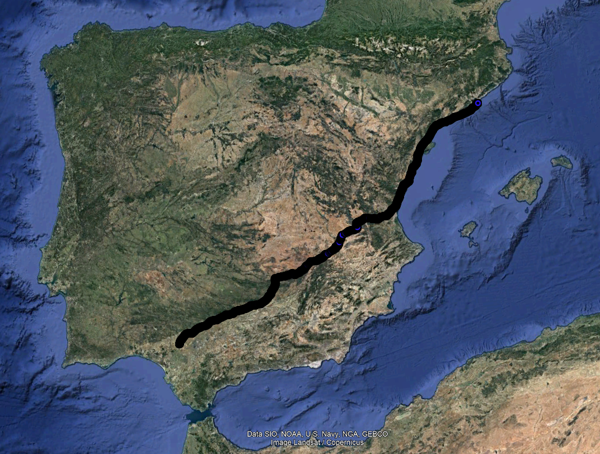
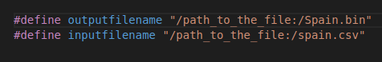
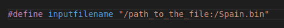

# README.MD
 
This project computes the optimal path (according to distance) from Bası́lica de Santa
Maria del Mar (Plaça de Santa Maria) in Barcelona to the Giralda (Calle Mateos Gago) in Sevilla by
using an AStar algorithm.


## Content
This proyect has three branches:
* Construct_graph_SPAIN: here we can find the code for structuring the data of Spain.csv. We can find the file [here](http://lluis-alseda.cat/MasterOpt/index.html). After executing the programme "structure_construct.c" a binary file will be generated which will be used in the "algorithm.c" program. 
* main_algorithm_SPAIN: this folder contains the main algorithm where the file exported in the previous phase is processed. Here we will find the programme "algorithm.c", which contains the main algorithm, and two ".h" files, which contain all the structures necessary to successfully execute the A* algorithm. All these programs must be in the same directory during execution.
* weighting_heuristic: in this folder you will find several experiments explained in the report. In addition, inside the file there is a sub-directory with a Jupyter notebook file which is in charge of representing the results obtained in the different experiments.

## Execution

First of all, we will have to make several modifications to the file paths. to do this, we will have to enter the following programs and change the path of the input and output file: 

* structure_construct.c


* algorithm.c (in main_algorithm_SPAIN and weighting_heuristic folders)



* functions_astar_nb (in main_algorithm_SPAIN and weighting_heuristic folders)


Once the directories where the input and output files are located have been changed, the execution is carried out in the following way:

**Construct_graph_SPAIN**
```{c}
gcc structure_construct.c -o export1.exe
```

**main_algorithm_SPAIN**

```{c}
gcc algorithm.c -lm -o export2.exe
```

**weighting_heuristic**

```{c}
gcc algorithm.c -lm -o export3.exe
```