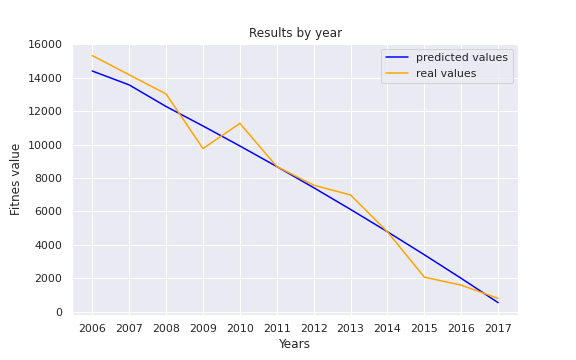
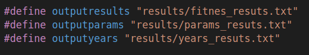
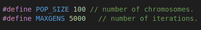

# README.MD

In this work we have tested the hypothesis that Andouine’s migration occurs with social copying
using a genetic algorithm. The genetic algorithm has been designed for the minimisation of the
fitness value defined in the first section and has given us a minimum result of 1.8M.


## Content

The repository contains all the material necessary for the operation of the algorithm. 

* binary.h : extension to generate binary numbers.

* EDO_solver: extension to resolve and calculate the results of the differential equation. Requires the program "rk78/RKF78.c" which is inside the rk78 folder.

*functions.h: contains all the necessary functions to generate the initial population and to generate the new populations.

*main_functional.c : contains the main algorithm. From this program the rest of the extensions are called.

## Execution

First of all, we will have to make several modifications to redirect the output file paths. to do this, we will have to enter to the following program and change the path of the output file:

* main_funcional.c




In case you want to change the number of iterations or the population size, just change the following parameters: 



The programme runs in the following way: 

```{c}
gcc main_funcional.c -lm -o export.exe
```