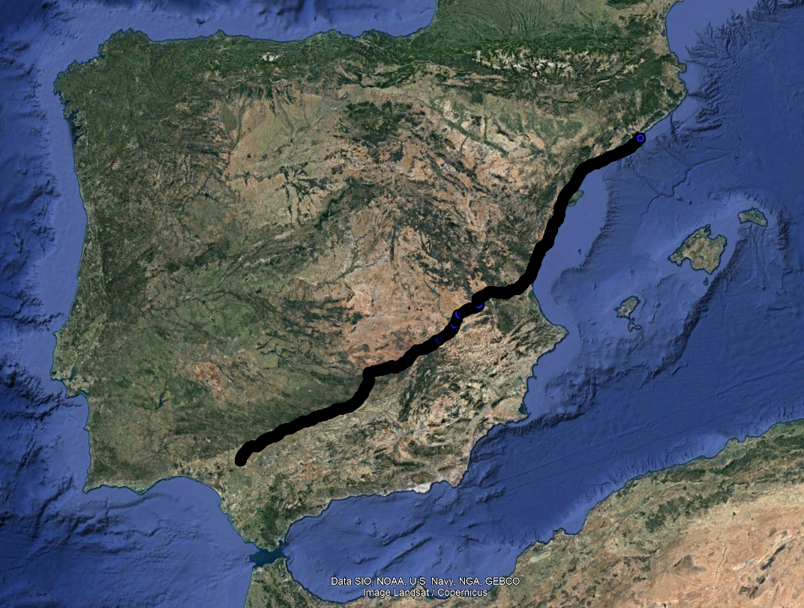

# README.MD
 
This project computes an optimal path (according to distance) from Bası́lica de Santa
Maria del Mar (Plaça de Santa Maria) in Barcelona to the Giralda (Calle Mateos Gago) in Sevilla by
using an AStar algorithm.


## Content
This proyect has three branches:
* Construct_graph_SPAIN: here we can find the code for structuring the data of Spain.csv. We can find the file [here](http://lluis-alseda.cat/MasterOpt/index.html)
* main_algorithm_SPAIN: this folder contains the main algorithm where the file exported in the previous phase is processed. 
* weighting_heuristic: in this folder you will find several experiments explained in the report. In addition, inside the file there is a sub-directory with a Jupyter notebook file which is in charge of representing the results obtained in the different experiments.

## Execution
Once the directories where the input and output files are located have been changed (at the top of the programmes), the execution is carried out in the following way:

**Construct_graph_SPAIN**
```{c}
gcc structure_construct.c -o export1.exe
```

**main_algorithm_SPAIN**

```{c}
gcc algorithm.c -o export2.exe
```

**weighting_heuristic**

```{c}
gcc algorithm.c -o export3.exe
```